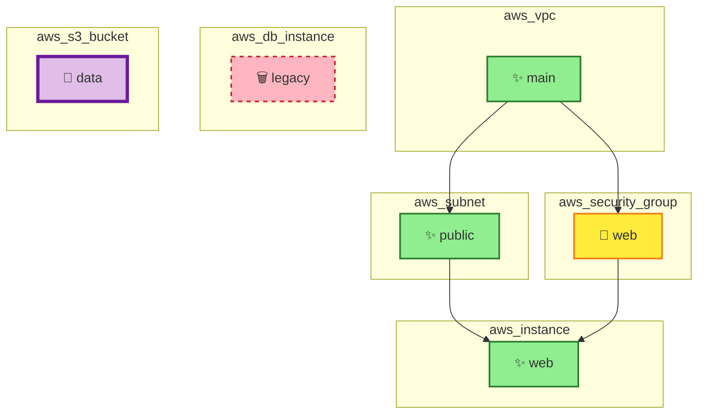

# Cloud Diff MCP

A Model Context Protocol (MCP) server for analyzing Terraform plans and visualizing infrastructure changes with Mermaid diagrams.

## Screenshot



**Legend:**
- 🟢 Green = Create
- 🟡 Yellow = Update
- 🔴 Red (dashed) = Delete
- 🟣 Purple (thick) = Replace

## Installation

```bash
npm install
npm run build
```

## Usage

Add to your MCP client configuration (e.g., Claude Desktop):

```json
{
  "mcpServers": {
    "cloud-diff": {
      "command": "node",
      "args": ["/path/to/cloud-diff-mcp/dist/index.js"]
    }
  }
}
```

## Tools

### `analyze_tf_plan`

Analyzes a Terraform plan JSON and generates a Mermaid diagram.

**Input:**
```json
{
  "plan": "<terraform-plan-json-string>"
}
```

**Output:**
- Change summary with counts
- Color-coded Mermaid diagram showing resources and dependencies

### `execute_tf_apply`

Simulates terraform apply execution (for demonstration).

## License

MIT