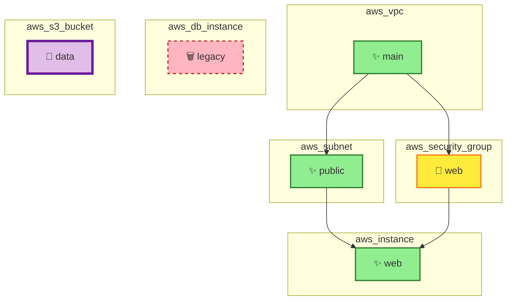

# Cloud Diff MCP

A Model Context Protocol (MCP) server for analyzing Terraform plans and visualizing infrastructure changes with interactive Mermaid diagrams.

## 📸 Screenshots

### Mermaid Diagram Visualization

The MCP server generates color-coded Mermaid diagrams showing infrastructure changes with dependencies:



**Legend:**
- 🟢 Green solid = Resources being **created** (✨)
- 🟡 Yellow solid = Resources being **updated** (📝)
- 🔴 Red dashed = Resources being **deleted** (🗑️)
- 🟣 Purple thick = Resources being **replaced** (🔄)
- → Arrows = Dependency relationships

### Complete Output Example

When analyzing a Terraform plan, you receive:

**1. Change Summary**
```
## Change Summary

- ✨ Create: 3
- 📝 Update: 1
- 🗑️ Delete: 1
- 🔄 Replace: 1
```

**2. Infrastructure Diagram** (shown above)

**3. Risk Assessment**
```
## Risk Summary

### Overall Risk: 🟢 LOW
**Risk Score:** 30/100

### Changes
- ✨ **Create:** 3 resources
- 📝 **Update:** 1 resource
- 🗑️ **Delete:** 1 resource
- 🔄 **Replace:** 1 resource

### ⚠️ High-Risk Changes
- **aws_security_group.web**: Security-sensitive resource modification
- **aws_db_instance.legacy**: Critical resource deletion
- **aws_s3_bucket.data**: Resource will be replaced (recreated)

### Recommendations
- ✅ Changes appear low-risk
- 📋 Standard review recommended
```

> 💡 **See [screenshots/OUTPUT_EXAMPLES.md](screenshots/OUTPUT_EXAMPLES.md) for more detailed examples and high-risk scenarios**

## Features

- 🔍 **Terraform Plan Analysis**: Parse and analyze Terraform plan JSON files
- 📊 **Visual Diagrams**: Generate Mermaid diagrams with color-coded infrastructure changes
  - ✨ **Create** (Green): New resources being added
  - 📝 **Update** (Yellow): Existing resources being modified
  - 🗑️ **Delete** (Red/Dashed): Resources being removed
  - 🔄 **Replace** (Purple/Thick): Resources being recreated
- 🎯 **Dependency Mapping**: Visualize resource dependencies as graph edges
- ⚠️ **Risk Assessment**: Automatic risk scoring and summary of infrastructure changes
- 🚀 **MCP Integration**: Seamless integration with MCP-compatible AI assistants

## Installation

```bash
npm install
npm run build
```

## Usage

### As an MCP Server

Add to your MCP client configuration (e.g., Claude Desktop):

```json
{
  "mcpServers": {
    "cloud-diff": {
      "command": "node",
      "args": ["/path/to/cloud-diff-mcp/dist/index.js"]
    }
  }
}
```

### Available Tools

#### 1. `analyze_tf_plan`

Analyzes a Terraform plan JSON and generates a comprehensive visualization.

**Input:**
```json
{
  "plan": "<terraform-plan-json-string>"
}
```

**Output:**
- Mermaid diagram showing resource changes
- Risk summary with severity scoring
- Change statistics (create/update/delete/replace counts)
- High-risk change warnings
- Recommendations based on risk level

#### 2. `execute_tf_apply`

Simulates the execution of `terraform apply` (for demonstration purposes).

**Input:**
```json
{
  "planId": "optional-plan-id",
  "autoApprove": false
}
```

**Output:**
- Execution status
- Safety considerations
- Production deployment recommendations

## Example

See `examples/sample-plan.json` for a sample Terraform plan that demonstrates:
- VPC and subnet creation
- EC2 instance creation with dependencies
- Security group updates
- Database instance deletion
- S3 bucket replacement

To test with the example:

```bash
# Read the sample plan
cat examples/sample-plan.json

# Use with your MCP client or test directly
node dist/index.js
```

## Architecture

```
cloud-diff-mcp/
├── src/
│   ├── index.ts                    # Main MCP server
│   └── utils/
│       ├── types.ts                # TypeScript type definitions
│       ├── mermaid-generator.ts    # Mermaid diagram generation
│       └── risk-summary.ts         # Risk analysis and scoring
├── examples/
│   └── sample-plan.json            # Example Terraform plan
├── package.json
├── tsconfig.json
└── README.md
```

## Mermaid Diagram Features

The generated Mermaid diagrams include:

- **Top-Down (TD) Layout**: Clear hierarchical visualization
- **Subgraphs by Resource Type**: Grouped resources for better organization
- **Dependency Edges**: Shows relationships between resources
- **Color-Coded Actions**: Visual distinction of change types
- **Action Icons**: Emoji indicators for quick identification

## Risk Assessment

The risk scoring system considers:

1. **Resource Type**: Critical resources (databases, VPCs) have higher weights
2. **Action Type**: Deletions and replacements scored higher than updates
3. **Security Impact**: Security groups and IAM resources flagged for review

Risk levels:
- 🟢 **LOW** (0-39): Standard changes with minimal risk
- 🟡 **MEDIUM** (40-69): Moderate changes requiring review
- 🔴 **HIGH** (70-100): Critical changes needing careful verification

## Development

```bash
# Install dependencies
npm install

# Build
npm run build

# Watch mode for development
npm run watch
```

## Security Considerations

⚠️ **Note**: The `execute_tf_apply` tool is currently a simulation. For production use:

- Implement proper authentication and authorization
- Add approval workflows
- Enable state locking
- Implement rollback mechanisms
- Add comprehensive audit logging
- Validate permissions before execution

## Contributing

Contributions are welcome! Please feel free to submit issues or pull requests.

## License

MIT License - see LICENSE file for details

## Author

Aviv Eldan