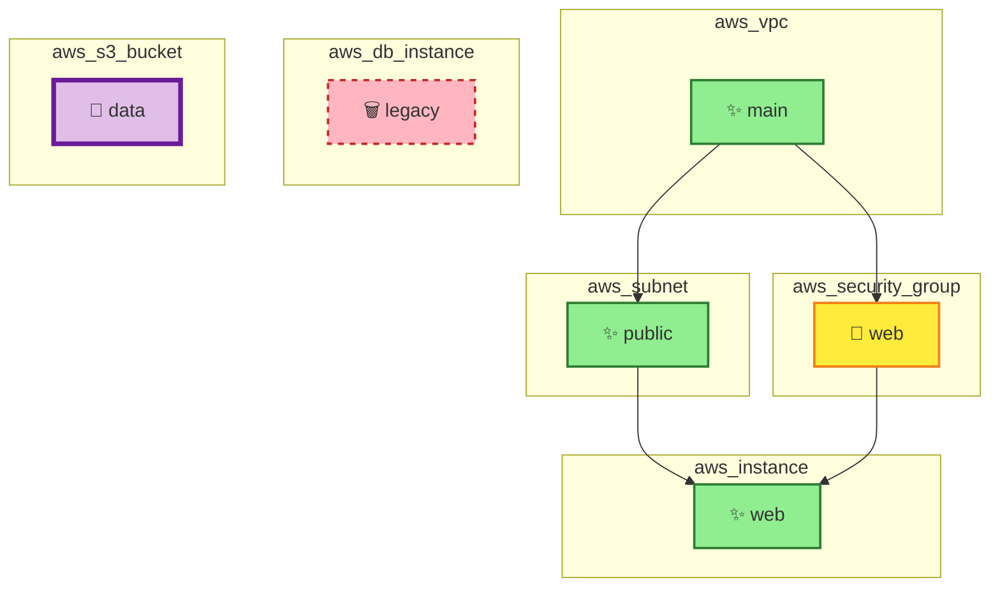

# Mermaid Diagram Example

Below is what the Mermaid diagram looks like when rendered:

## Sample Output

For the sample plan in `examples/sample-plan.json`, the server generates:

### Infrastructure Change Visualization



### Legend

- ✨ **Create** (Green solid): New resources being added
- 📝 **Update** (Yellow solid): Existing resources being modified  
- 🗑️ **Delete** (Red dashed): Resources being removed
- 🔄 **Replace** (Purple thick): Resources being recreated

### Dependencies

Arrows (→) show resource dependencies. For example:
- `aws_vpc.main` → `aws_subnet.public` (subnet depends on VPC)
- `aws_subnet.public` → `aws_instance.web` (instance depends on subnet)
- `aws_security_group.web` → `aws_instance.web` (instance depends on security group)

## Risk Assessment Output

```
## Risk Summary

### Overall Risk: 🟢 LOW
**Risk Score:** 30/100

### Changes

- ✨ **Create:** 3 resources
- 📝 **Update:** 1 resource
- 🗑️ **Delete:** 1 resource
- 🔄 **Replace:** 1 resource

### ⚠️ High-Risk Changes

- **aws_security_group.web** (aws_security_group): Security-sensitive resource modification
- **aws_db_instance.legacy** (aws_db_instance): Critical resource deletion
- **aws_s3_bucket.data** (aws_s3_bucket): Resource will be replaced (recreated)

### Recommendations

- ✅ Changes appear low-risk
- 📋 Standard review recommended
```

## Interactive Features

When integrated with an MCP client (like Claude Desktop), users can:

1. **View the Diagram**: See the visual representation of infrastructure changes
2. **Review Risk Summary**: Understand the impact and risk level of changes
3. **Approve & Apply**: Use the "Approve & Apply" button to execute `execute_tf_apply` tool (currently simulated for safety)

## Color Coding Details

| Action | Color | Style | Use Case |
|--------|-------|-------|----------|
| Create | Green (#90EE90) | Solid border | New infrastructure resources |
| Update | Yellow (#FFEB3B) | Solid border | Modifications to existing resources |
| Delete | Red (#FFB6C1) | Dashed border | Resources being removed |
| Replace | Purple (#E1BEE7) | Thick border (4px) | Resources being recreated |
