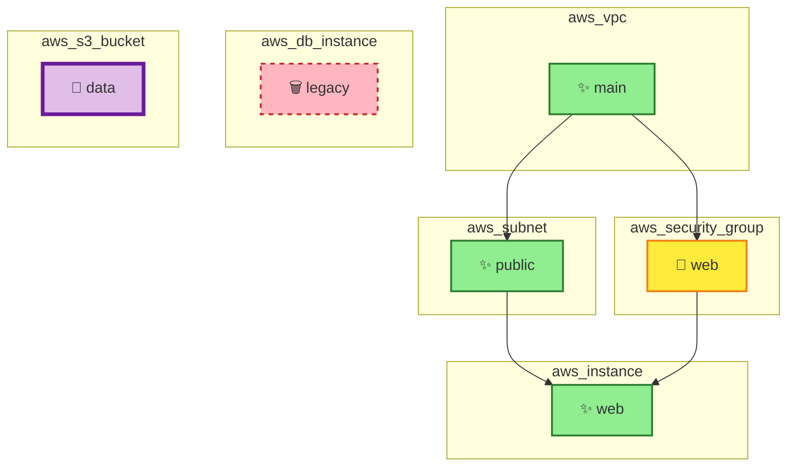

# Visual Output Examples

## Example 1: Terraform Plan Analysis Output

When you use the `analyze_tf_plan` tool, the MCP server generates a comprehensive analysis with three main sections:

### 1. Change Summary

Shows the count of each type of infrastructure change:

```
## Change Summary

- ✨ Create: 3
- 📝 Update: 1
- 🗑️ Delete: 1
- 🔄 Replace: 1
```

### 2. Infrastructure Change Visualization (Mermaid Diagram)

The Mermaid diagram provides a visual graph of all infrastructure changes with color-coding:



**Visual Legend:**
- 🟢 **Green nodes** (✨) = Resources being created
- 🟡 **Yellow nodes** (📝) = Resources being updated
- 🔴 **Red dashed nodes** (🗑️) = Resources being deleted
- 🟣 **Purple thick-border nodes** (🔄) = Resources being replaced
- **Arrows** show dependency relationships

### 3. Risk Summary

Provides intelligent risk assessment with actionable recommendations:

```
## Risk Summary

### Overall Risk: 🟢 LOW
**Risk Score:** 30/100

### Changes

- ✨ **Create:** 3 resources
- 📝 **Update:** 1 resource
- 🗑️ **Delete:** 1 resource
- 🔄 **Replace:** 1 resource

### ⚠️ High-Risk Changes

- **aws_security_group.web** (aws_security_group): Security-sensitive resource modification
- **aws_db_instance.legacy** (aws_db_instance): Critical resource deletion
- **aws_s3_bucket.data** (aws_s3_bucket): Resource will be replaced (recreated)

### Recommendations

- ✅ Changes appear low-risk
- 📋 Standard review recommended
```

---

## Example 2: High-Risk Scenario

For more critical infrastructure changes, the output adapts to show higher risk levels:

```
## Risk Summary

### Overall Risk: 🔴 HIGH
**Risk Score:** 85/100

### Changes

- 🗑️ **Delete:** 5 resources
- 🔄 **Replace:** 2 resources

### ⚠️ High-Risk Changes

- **aws_rds_cluster.production** (aws_rds_cluster): Critical resource deletion
- **aws_vpc.main** (aws_vpc): Critical resource deletion
- **aws_iam_role.admin** (aws_iam_role): Security-sensitive resource modification

### Recommendations

- ⚠️ **Review carefully** before applying changes
- 🔍 Verify all resource dependencies
- 💾 Ensure backups are in place
- 👥 Consider peer review for critical changes
```

---

## Integration with MCP Clients

When integrated with Claude Desktop or other MCP clients, users can:

1. **Paste Terraform plan JSON** into the conversation
2. **Request analysis** by mentioning the `analyze_tf_plan` tool
3. **View the rendered diagram** directly in the chat interface
4. **Review risk assessment** and make informed decisions
5. **Execute apply** (simulated) using the `execute_tf_apply` tool

### MCP Client View

In Claude Desktop, the output appears as a formatted markdown response with:
- Rendered Mermaid diagrams (interactive, zoomable)
- Color-coded risk indicators
- Clickable action buttons for apply workflow

---

## Color Coding Reference

| Action | Icon | Color | Border Style | Use Case |
|--------|------|-------|--------------|----------|
| Create | ✨ | Green (#90EE90) | Solid 2px | New infrastructure |
| Update | 📝 | Yellow (#FFEB3B) | Solid 2px | Modified resources |
| Delete | 🗑️ | Red (#FFB6C1) | Dashed 2px | Removed resources |
| Replace | 🔄 | Purple (#E1BEE7) | Thick 4px | Recreated resources |

---

## Risk Scoring System

The risk score (0-100) is calculated based on:

1. **Resource Type Criticality**
   - Databases, VPCs, IAM: High weight (4-5x)
   - S3, Lambda: Medium weight (2x)
   - Others: Standard weight (1x)

2. **Action Severity**
   - Delete: 10x multiplier
   - Replace: 8x multiplier
   - Update: 3x multiplier
   - Create: 1x multiplier

3. **Risk Levels**
   - 🟢 **LOW (0-39)**: Standard changes with minimal risk
   - 🟡 **MEDIUM (40-69)**: Moderate changes requiring review
   - 🔴 **HIGH (70-100)**: Critical changes needing careful verification
