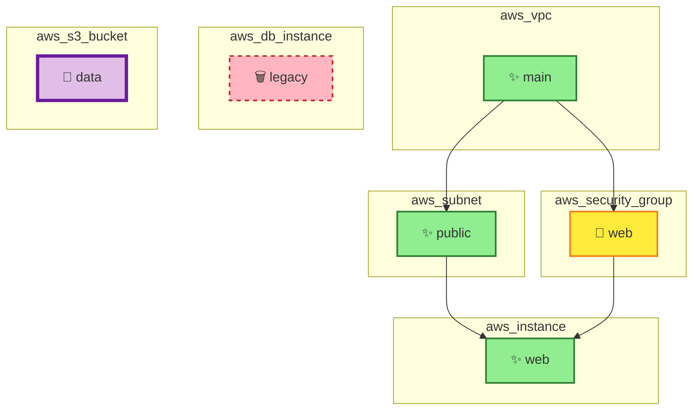

# Visual Examples - README Screenshots

This document shows how the README.md displays with the new screenshots section.

---

## README.md Preview

### Header Section


---

# Cloud Diff MCP

A Model Context Protocol (MCP) server for analyzing Terraform plans and visualizing infrastructure changes with interactive Mermaid diagrams.

---

## 📸 Screenshots

### Mermaid Diagram Visualization

The MCP server generates color-coded Mermaid diagrams showing infrastructure changes with dependencies:



**Legend:**
- 🟢 Green solid = Resources being **created** (✨)
- 🟡 Yellow solid = Resources being **updated** (📝)
- 🔴 Red dashed = Resources being **deleted** (🗑️)
- 🟣 Purple thick = Resources being **replaced** (🔄)
- → Arrows = Dependency relationships

---

### Complete Output Example

When analyzing a Terraform plan, you receive:

**1. Change Summary**
```
## Change Summary

- ✨ Create: 3
- 📝 Update: 1
- 🗑️ Delete: 1
- 🔄 Replace: 1
```

**2. Infrastructure Diagram** (shown above)

**3. Risk Assessment**
```
## Risk Summary

### Overall Risk: 🟢 LOW
**Risk Score:** 30/100

### Changes
- ✨ **Create:** 3 resources
- 📝 **Update:** 1 resource
- 🗑️ **Delete:** 1 resource
- 🔄 **Replace:** 1 resource

### ⚠️ High-Risk Changes
- **aws_security_group.web**: Security-sensitive resource modification
- **aws_db_instance.legacy**: Critical resource deletion
- **aws_s3_bucket.data**: Resource will be replaced (recreated)

### Recommendations
- ✅ Changes appear low-risk
- 📋 Standard review recommended
```

> 💡 **See [screenshots/OUTPUT_EXAMPLES.md](screenshots/OUTPUT_EXAMPLES.md) for more detailed examples and high-risk scenarios**

---

## What Changed

The README now includes:

1. **📸 Screenshots Section** - Added immediately after the title/description
2. **Mermaid Diagram Example** - Shows actual color-coded visualization with emoji icons
3. **Complete Output Example** - Demonstrates all three parts of the analysis output
4. **Visual Legend** - Explains the color coding system
5. **Link to Detailed Examples** - Points to `screenshots/OUTPUT_EXAMPLES.md` for more scenarios

---

## Benefits of These Screenshots

✅ **Immediate Visual Understanding** - Users see what the tool produces before installing  
✅ **Color Coding Clarity** - Legend shows the meaning of each color and style  
✅ **Full Feature Preview** - All three output sections (summary, diagram, risk) displayed  
✅ **Professional Documentation** - GitHub renders Mermaid diagrams natively  
✅ **Easy Reference** - Users can compare their output against the examples  

---

## Files Modified

- `README.md` - Added screenshots section at line 5
- `screenshots/OUTPUT_EXAMPLES.md` - Comprehensive visual examples with multiple scenarios

## GitHub Rendering

When viewed on GitHub, the Mermaid diagram will be rendered as an interactive, color-coded graph showing:
- Green boxes for created resources (aws_vpc.main, aws_subnet.public, aws_instance.web)
- Yellow box for updated resource (aws_security_group.web)
- Red dashed box for deleted resource (aws_db_instance.legacy)
- Purple thick-border box for replaced resource (aws_s3_bucket.data)
- Arrows showing dependencies between resources
